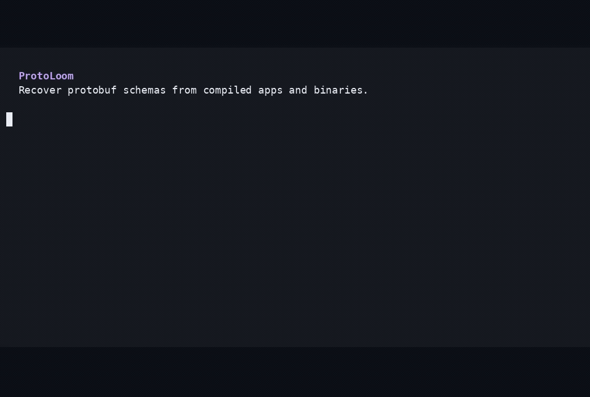

<div align="center">

# ProtoLoom

### Recover Protocol Buffer schemas from compiled apps and binaries.

Turn APKs, DEX files, native binaries, and Go programs into usable `.proto`
files—with clear confidence and evidence for every result.

[](https://www.python.org/)
[](LICENSE)

</div>

<div align="center">
  
</div>

## What it does

ProtoLoom finds protobuf information that remains inside compiled software and
rebuilds it into files you can inspect and use. It works directly with:

- Android apps and bundles (`.apk`, `.aab`, `.dex`)
- Java archives (`.jar`, `.zip`)
- Linux, macOS, and Windows binaries
- Go binaries containing protobuf descriptors

No decompiler or AI service is required. When ProtoLoom cannot prove something,
it reports the uncertainty instead of silently guessing.

## Install

ProtoLoom requires Python 3.11 or newer. From a local checkout:

```console
uv tool install .
```

## Use

Inspect a file:

```console
protoloom inspect app.apk
```

Recover its schemas:

```console
protoloom extract app.apk --output out
```

Open `out/dashboard/index.html` for the visual report, or use the generated
`.proto` files directly. The output also includes a descriptor set,
`recovery.json`, and a Markdown report.

For difficult Android apps, jadx can be enabled as an optional fallback:

```console
protoloom extract app.apk --jadx --output out
```

Try ProtoLoom without supplying a binary:

```console
protoloom demo
```

## Why ProtoLoom

- Produces compilable `.proto` files, not raw string dumps
- Shows where each recovered field came from
- Keeps uncertain results visible
- Runs deterministically without cloud services
- Handles nested archives and multiple binary formats
- Is tested against pinned upstream schemas and real applications

ProtoLoom is currently alpha software. Obfuscation can permanently remove
names, types, and relationships, so some apps will produce partial results.
Detailed measurements and known limitations are published in
[`benchmarks/results.md`](benchmarks/results.md).

## Development

```console
uv sync --extra dev --group dev
uv run make check
```

See [`CONTRIBUTING.md`](CONTRIBUTING.md) to contribute and
[`SECURITY.md`](SECURITY.md) to report a vulnerability.

## License

Apache License 2.0. See [`LICENSE`](LICENSE).
